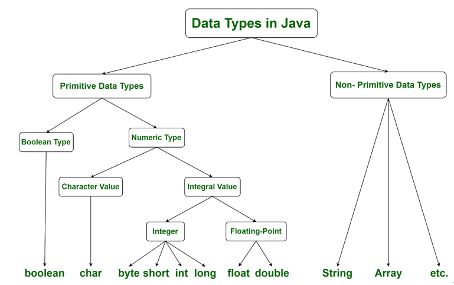
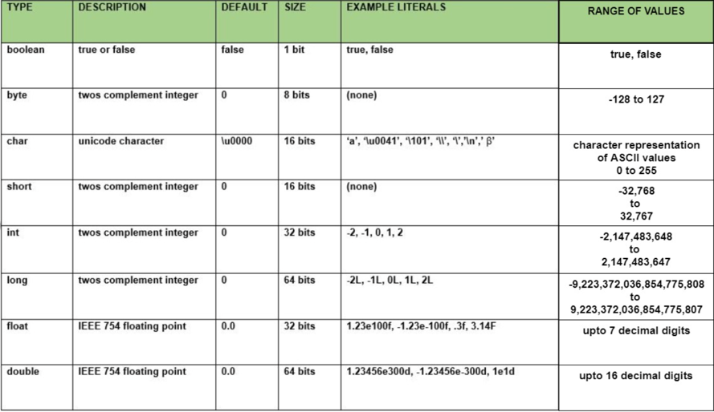

I hope you are excited enough to move our focus to more academic stuff.

We start exploring more types called `Primitives`, considering their size.

Prerequisites: 1 byte = 8 bit = 1 bit can store either `0` or `1`
binary numbers -> octal -> decimal -> hex
It is not critical for our learning path, however, you can always google it for the sake of curiosity

While developing this course, I am becoming lazy, so you have screenshots from the internet)))

So primitive types in pictures:
* In hierarchy
* 
* With description
* 

Run example to gain your computer six sense