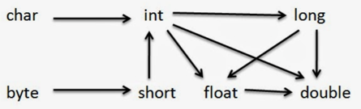

I know that types and conversions may be annoying, my dear friend.
But believe me, we must learn a couple of fundamental concepts to remember how things work internally.

So we went through some implicit and explicit conversions between types.

* When the value of a smaller type can be stored in a bigger variable.




What if we want to convert from long to int? From bigger types to smaller
In this case, we should cast forcibly considering the possible loosing of data
There is operation `(type)`


```
// todo refactor
short s = 23; 
byte b = (byte) s;
// we get proper result b = 23 
// but we might lose some data if we do the following

short s1 = 300;
byte b1 = (byte) s1;

// b1 => 44. It is strange, isn't?
// byte allocates 8 bits

//To undertand it, we should present our data in a binary view

//300 -> 00000001 00101100 16 bits
//when we cast to byte we take only the first 8 bits
//Hence we take the right part 00101100
//As you see, we lost one bit (not empty (1))
// if we convert 00101100 to decimal, there will be 44

// if we go from double to int, we lose number after floating point
double myDouble = 9.78d;
int myInt = (int) myDouble; // Manual casting: double to int

// myDouble 9.78
// myInt 9
_ _ _ _ _ _ _ _  
```

Please see the code example or use any decimal to a binary calculator to confirm that.

I hope I did not bug you. Wait a bit to have more real-world examples after boring "types"))
