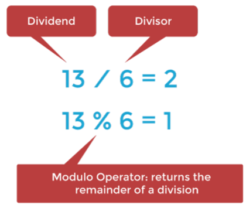
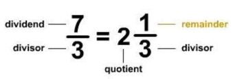
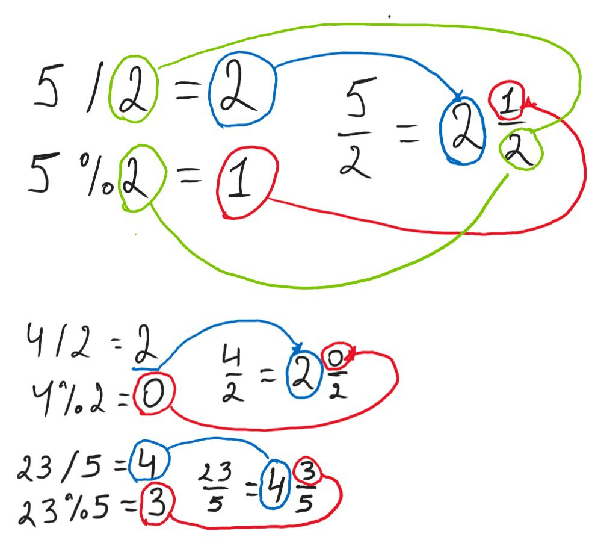

Hola Amigo)))

Finally, we passed a topic regarding casting.
Now we want to work with arithmetical operations.

It should be easy for us after more complicated topics behind.

A bit of theory:

* We can perform basic mathematical operations over:
  * `byte, short, int, long, float, double`
* operations
  * `+, -, *, /, %`
    * an Important note about `/, %`. It can return different results depending on the types participating in an operation
    * rule `int / int = int`, `int % int = int`
    * recall what "Fraction" is
    * 
    * ---------------------
    * 
    * More Visual Examples
    * 
  * `++, --`
* Remember how stronger types interact with weaker ones `double + int = double`

Don't waste time on talks and get to example.