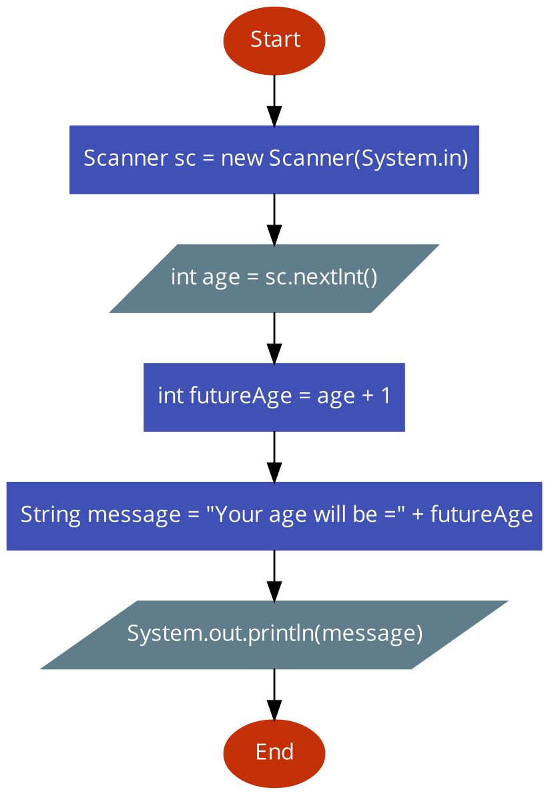
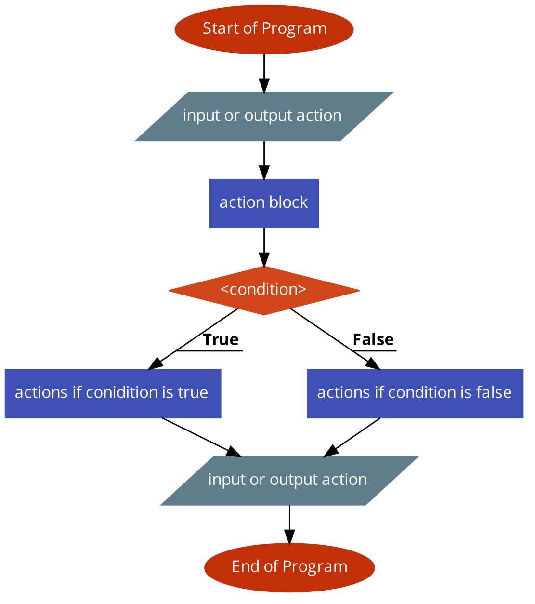
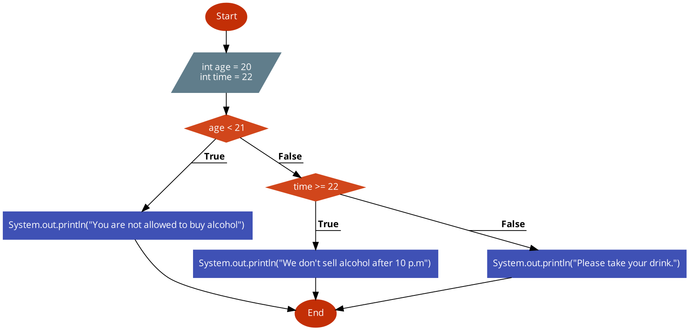
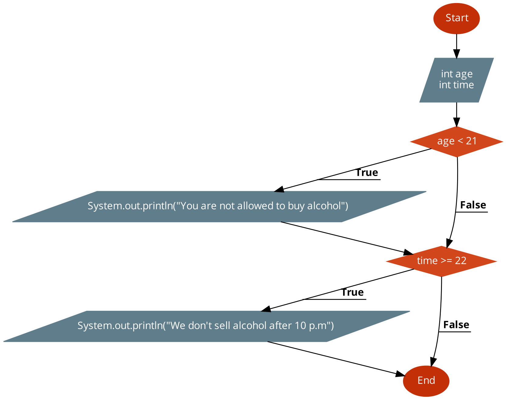
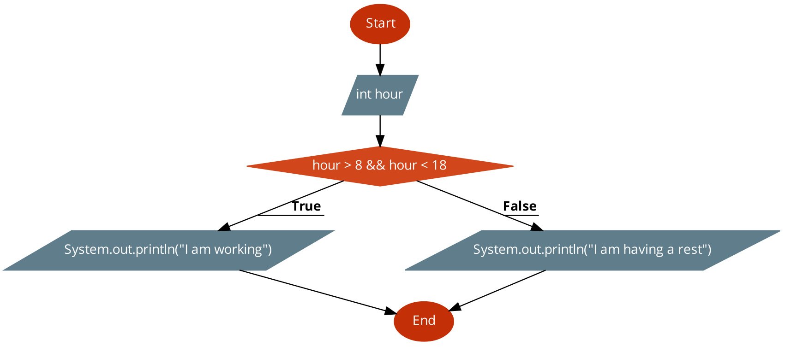
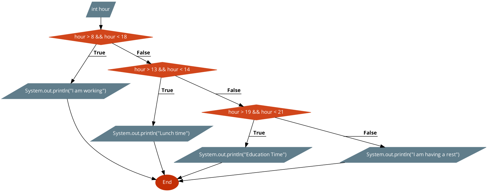

Nice job! I am happy that you are mastering your skills rapidly.

Apart from your solution, I bet you struggle sometimes as code seems like spaghetti.

In order to comprehend better, we should learn how to visualize the algorithms (sequence of instructions).

Please welcome **Flowchart**. I reckon you met somewhere this way of presenting of algorithms.

It has the following view:
*** 
Age calculator:

Code: 

```
Scanner sc = new Scanner(System.in);
int age = sc.nextInt();
int futureAge = age + 1;
String message = "Your age will be =" + futureAge;
System.out.println(message);
```

Flowchart:


***

Components in Flowchart



*** 

We are going to review more examples...

Decision whether a market sells alcohol: [task3](course://week2_conditional_flows/lesson1_flow_control_if_block_simple/task3/src/Main.java)


Code with connected `if` blocks: 

```
int age;
int time;

// This example should have more sense with if-else logic
if (age < 21) {
 System.out.println("You are not allowed to buy alcohol");
} else if (time >= 22) {
 System.out.println("We don't sell alcohol after 10 p.m");
} else {
 System.out.println("Please take your drink.");
}
```

Flowchart:

***

Example with `if` blocks (not connected)

Code: 

```
int age = 18;
int time = 10;

if (age < 21) {
 System.out.println("You are not allowed to buy alcohol");
}

if (time >= 22) {
 System.out.println("We don't sell alcohol after 10 p.m");
}
```

FlowChart: 


***

```
int hour;
if (hour > 8 && hour < 18) {
   System.out.println("I am working");
} else { 
   System.out.println("I am having a rest");
}
```



*** 

```
int hour;
if (hour > 8 && hour < 18) {
   System.out.println("I am working");
} else if (hour > 13 && hour < 14) { 
   System.out.println("Lunch time");
} else if (hour > 19 && hour < 21) {
   System.out.println("Education Time");
} else { 
   System.out.println("I am having a rest");
}
```



*** 

Be attentive and try to do visualization:
* Go from **flowchart** to code and vise versa
* It will help a lot
* You will have tasks where you should write code from **flowchart**