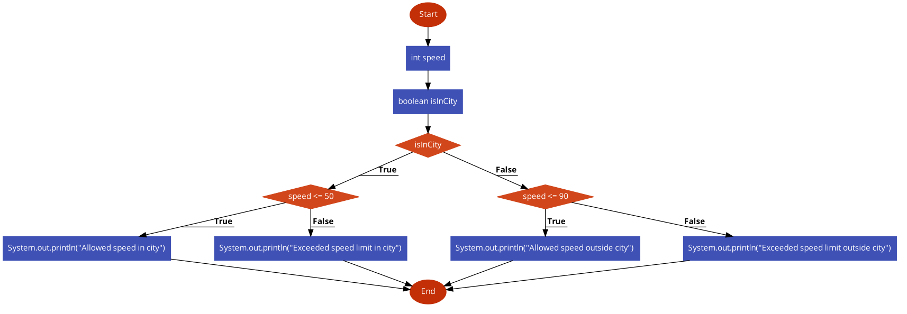
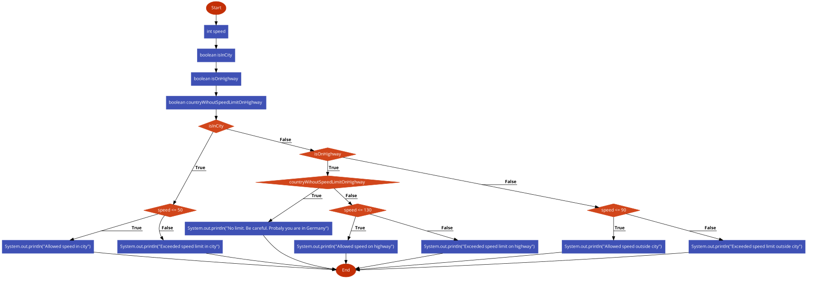

It's time to extend out knowledge about `if` control flows. Namely, nested blocks.
When `if block` can contain other `if blocks` inside.

Example: 

```
if (...) {
    if (...) {
        // logic
    } 
}
```

```
if (...) {
    if (...) {
        if (...) {
            // logic
        } else {
            // logic
        }
    } else if (...) {
        // logic
    } else {
        // logic
    }
} 
```

There is no limitation on number of nested blocks...

This approach gives us flexibility and unlimited abilities while implementing any algorithm.
***
Let's review more real-world examples:

Example 1 Speed Limit considering location:

Code:
```
int speed;
boolean isInCity;

if (isInCity) {
    if (speed <= 50) {
        System.out.println("Allowed speed in city");
    } else {
        System.out.println("Exceeded speed limit in city");
    }
} else {
    if (speed <= 90) {
        System.out.println("Allowed speed outside city");
    } else {
        System.out.println("Exceeded speed limit outside city");
    }
}
```

FlowChart:



Please copy the code to visualizer, play with (set different values) `speed` and `isInCity` to get into each block...

Ensure you understand how nested blocks work.
*** 
Example 2 Speed Limit considering country and highways

```
int speed;
boolean isInCity;
boolean isOnHighway;
boolean countryWihoutSpeedLimitOnHighway;

if (isInCity) {
    if (speed <= 50) {
        System.out.println("Allowed speed in city");
    } else {
        System.out.println("Exceeded speed limit in city");
    }
} else if (isOnHighway) {
    if (countryWihoutSpeedLimitOnHighway) {
        System.out.println("No limit. Be careful. Probaly you are in Germany");
    } else if (speed <= 130) {
        System.out.println("Allowed speed on highway");
    } else {
        System.out.println("Exceeded speed limit on highway");
    }
} else {
    if (speed <= 90) {
        System.out.println("Allowed speed outside city");
    } else {
        System.out.println("Exceeded speed limit outside city");
    }
}
```

FlowChart:


Please copy the code and visualize as you did with the previous example.

