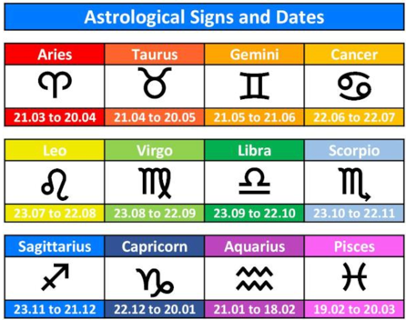
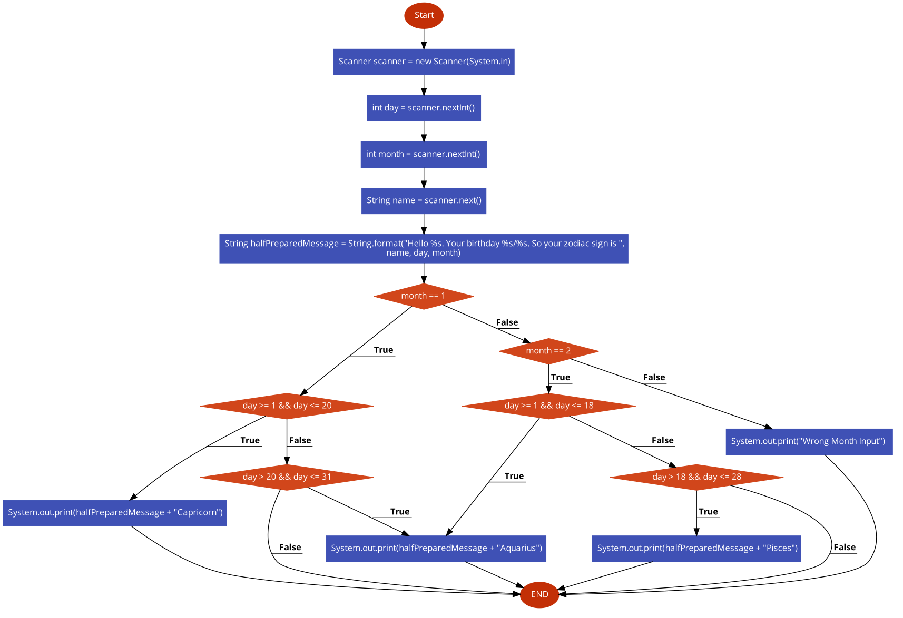

Our course is changing direction from mathematical to intuitive ;)

Come on! Let's define your Zodiac Sign based on birthday (day and month)

There are some notes to avoid googling:

Astrological Sign and Dates


Days in Months
```
January - 31 days
February - 28 days in a common year and 29 days in leap years
March - 31 days
April - 30 days
May - 31 days
June - 30 days
July - 31 days
August - 31 days
September - 30 days
October - 31 days
November - 30 days
December - 31 days
```

Implement the logic from **flowchart** :

Diagram contains only logic for the first two months...




