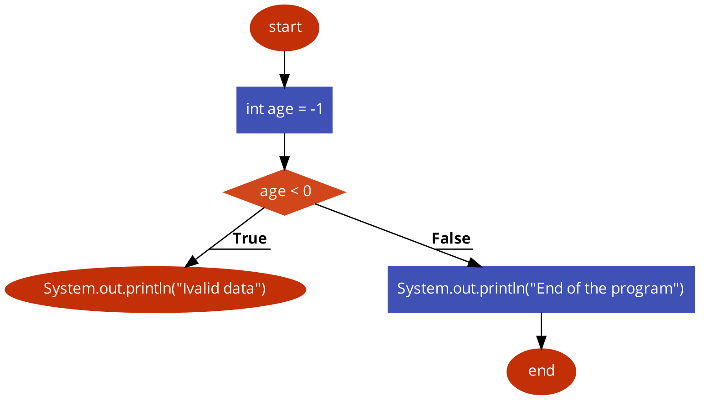
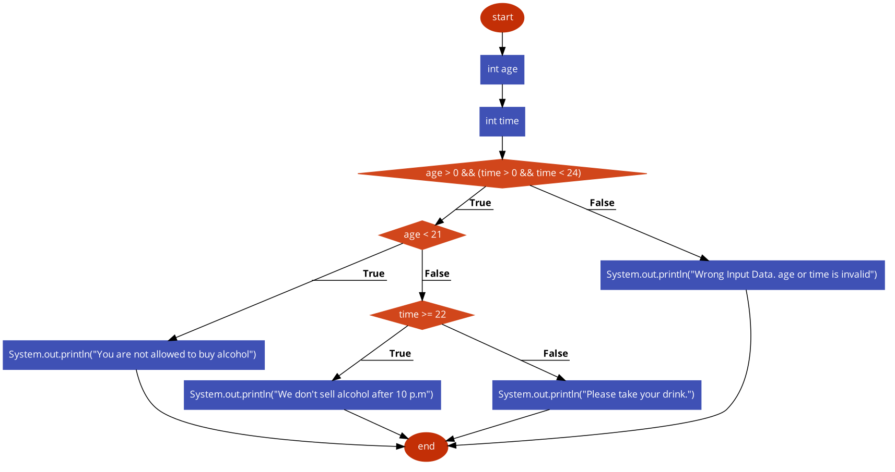
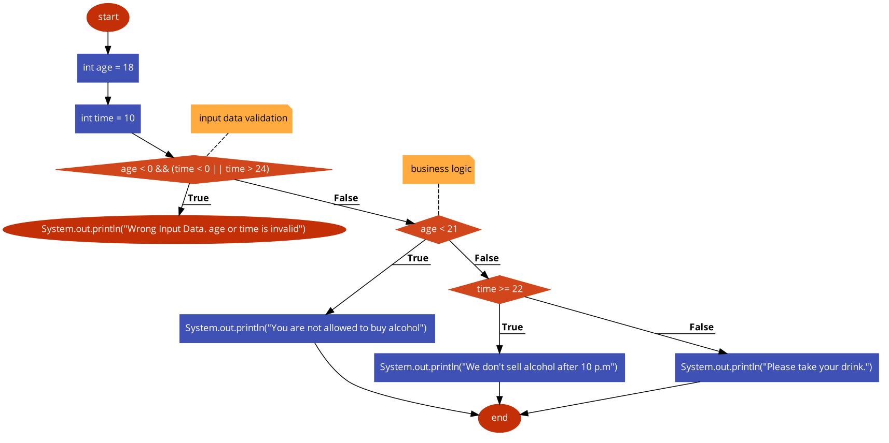

Data Validation Topic:

Almost each tasks we read data from Scanner, it will not be changed in the real-words projects.

Your programs will accept various data from different sources.

Unfortunately, the input data are not always correct, for an example:

```
int age = -23;
double price = -88;
String name = "xxxxxxxxx";
int heartRate = 0;
```

As it is seen on above, those data are not valid.

Hence, in most cases there is no sense to calculate or continue the logic
once we see that data are not applicable for further logic.

There is a way to stop a program in any moment of the execution. Keyword `return` will help.

Example:

```java
class Example {
    public static void main(String[] args) {
        int age = -1;

        if (age < 0) {
            // return will break main method. As main method(function) is only method in our execution. 
            // It terminates the application  
            return;
        }

        // this line will not be executed
        System.out.println("End of the program");
    }
}
```

FlowChart: 



Please, copy/paste the code to visualizer and see how it works.

On the other hand, we can simplify our code,
make it beautiful if we use `return` to terminate the application once we notice invalid data

***
Example without `return` keyword:

```java
class Example {
    public static void main(String[] args) {
        int age = 18;
        int time = 10;
        
        if (age > 0 && (time > 0 && time < 24)) {
            if (age < 21) {
                System.out.println("You are not allowed to buy alcohol");
            } else if (time >= 22) {
                System.out.println("We don't sell alcohol after 10 p.m");
            } else {
                System.out.println("Please take your drink.");
            }
        } else {
            System.out.println("Wrong Input Data. age or time is invalid");
        }
        
    }
}
```

Flowchart:


***
Example with `return`:

```java
class Example {
    public static void main(String[] args) {
        int age = 18;
        int time = 10;
        
        // input data validation
        if (age < 0 && (time < 0 || time > 24)) {
            System.out.println("Wrong Input Data. age or time is invalid");
            return;
        }

        // business logic
        if (age < 21) {
            System.out.println("You are not allowed to buy alcohol");
        } else if (time >= 22) {
            System.out.println("We don't sell alcohol after 10 p.m");
        } else {
            System.out.println("Please take your drink.");
        }
        
    }
}
```

Flowchart:


Doesn't it look better?

***
Please visualize all the examples