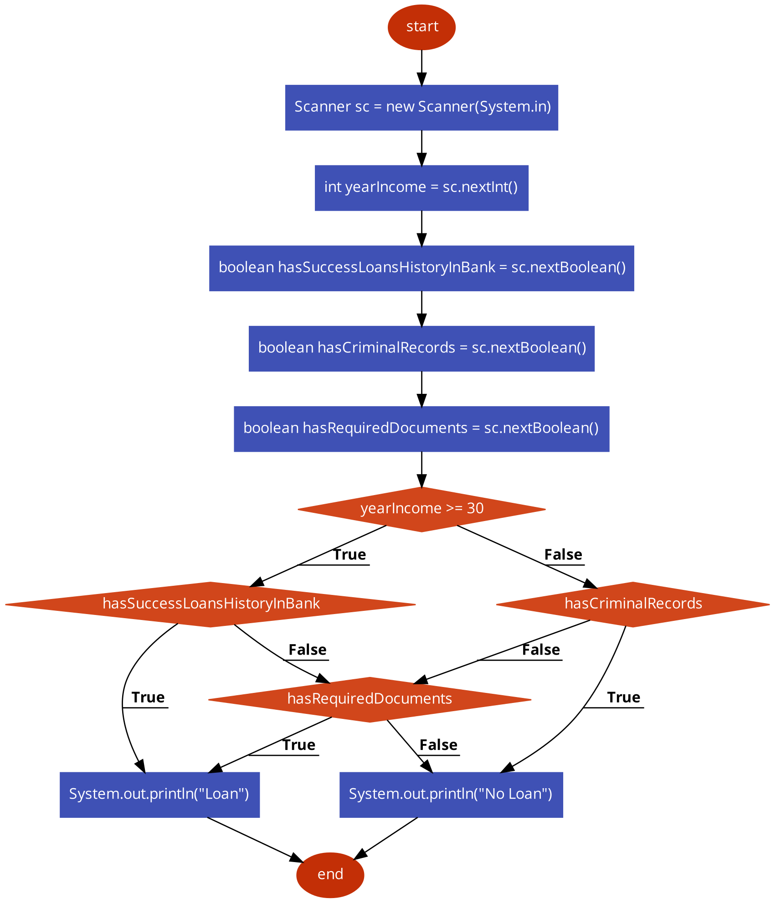

If you have come so far, your motivation is powerful.

Let's complicate our logic a bit. No worries, we will do it gradually.

Our target is still a nested block, although with deepness 3.
```
  if () {
    if () {
      if () {
        ...
      }
    }
  }
```

Let's review the following task (Program that decides if we can give a loan to a client):

We got the input data:
```
int yearIncome;
boolean hasSuccessLoansHistoryInBank;
boolean hasCriminalRecords;
boolean hasRequiredDocuments;
```

A bank can give a loan if a client meets the following conditions:
* (yearIncome >= 30 AND hasSuccessLoansHistoryInBank) OR
* (yearIncome >= 30 AND NOT hasSuccessLoansHistoryInBank AND hasRequiredDocuments) OR
* (yearIncome < 30 AND NOT hasCriminalRecords AND hasRequiredDocuments)

Other way to define a task:

* yearIncome >= 30
  * hasSuccessLoansHistoryInBank - LOAN
  * NOT hasSuccessLoansHistoryInBank
    * hasRequiredDocuments LOAN
    * NOT hasRequiredDocuments No Loan
* yearIncome < 30
  * NOT hasCriminalRecords
    * hasRequiredDocuments - Loan
  * hasCriminalRecords - No Loan

In other cases, we should reject a request for a loan
In success cases, we print "Loan", otherwise "No Loan"

Let's transform our conditions into a **flowchart**:



After all, the material you have seen, please code the task.