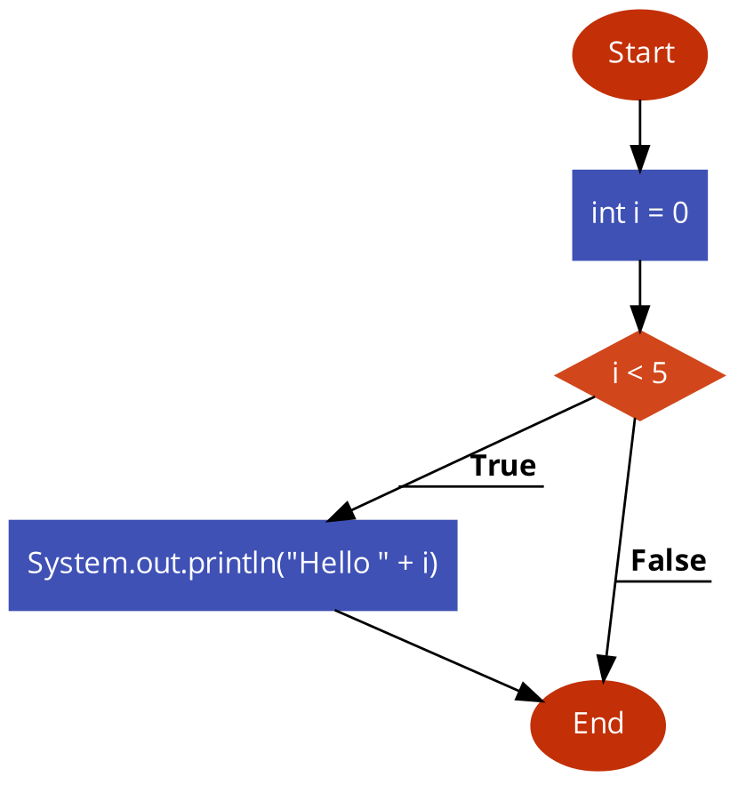
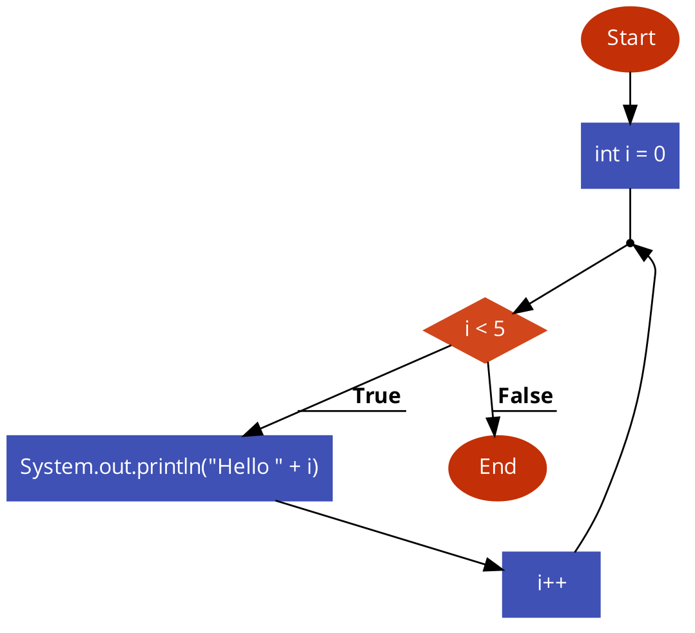

### Introduction
Probably you will hate me once you know how this topic could have simplified you life while working with arrays.

So please welcome **loop** lesson:

### Problem to be solved
* Repeating some instructions two or more times until specific condition is met.
* Great to process arrays or similar structures
* 

### Structure of while loop
```
while (<condition>) {
    // instuctions to be repeated
}
```

### Types Of Loop blocks
* `while(<dondition>) {...}`
* `do {} while (<dondition>);`
* `for(<init>; <condition>; <step>) {}`

### Examples
If block 

Code: 
```java
class Main {
    public static void main(String[] args) {
        int i = 0;
        // if block checks condition only once
        if (i < 5) {
            System.out.println("Hello " + i);
        }
    }
}
```

Flowchart:


-----
While Block 

Code:
```java
class Main {
    public static void main(String[] args) {
        int i = 0;
        // we run code inside while block every time when condition is true
        // we change i in order to exit the while block, 
        // otherwise we run infinitive number of times this block
        // hence we print Hello 5 times
        while (i < 5) {
            System.out.println("Hello " + i);
            // we change `i` to exit while block
            // `i` is being used in condition in while block
            i++; 
        }
    }
}
```
Flowchart:

---

Example 

Please take a pause and meditate on the below flowcharts to understand how `if` block differs from `while` block.

